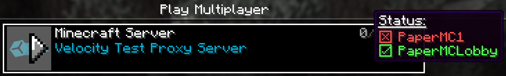

# ServerlistStatusChecker

## Description

This plugin will show the online statuses of all subservers when hovering over the player count.

It works out-of-the-box, no configuration needed.

The main target group for this plugin are small self-hosted server networks, which might not be online all the time.
Players can instantly see, if all their desired servers are online at the moment.

## Preview

## Prerequisites

- Java 17
- Velocity Proxy (v3.3.0 or higher)

## Installation

Just put the `.jar` file from the [Releases](https://github.com/xTheAgentx/ServerlistStatusChecker/releases) page into
the `plugins` folder of your Velocity installation.
